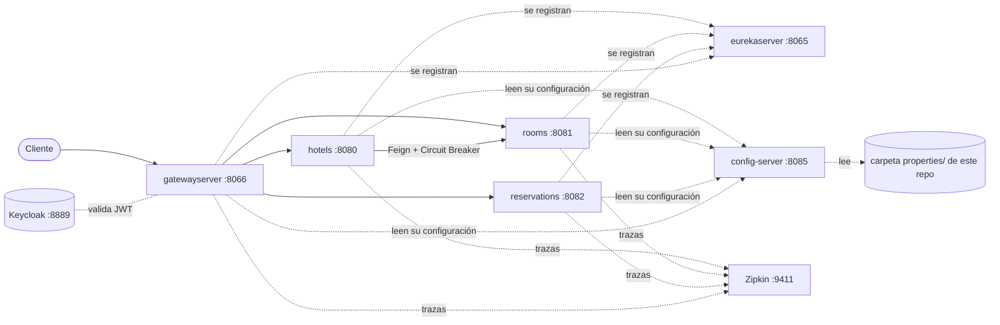

# Arquitectura - Microservices HOTEL

Proyecto para entender cómo funciona una arquitectura de microservicios con **Spring Boot 3** y **Spring Cloud**: tres servicios de negocio (hoteles, habitaciones y reservas) detrás de un gateway, con configuración centralizada, descubrimiento de servicios, tolerancia a fallos, trazabilidad y seguridad con OAuth 2.

## 📌 Arquitectura



| Módulo | Puerto | Qué hace |
|---|---|---|
| `config-server` | 8085 | Configuración centralizada (Spring Cloud Config). Lee la carpeta [`properties/`](properties) de este repositorio. |
| `eurekaserver` | 8065 | Registro y descubrimiento de servicios (Eureka). |
| `gatewayserver` | 8066 | Punto de entrada (Spring Cloud Gateway) y validación de tokens JWT de Keycloak. |
| `hotels` | 8080 | Hoteles. Consulta las habitaciones a `rooms` con RestTemplate (v1) y con Feign + Resilience4j (v2). |
| `rooms` | 8081 | Habitaciones por hotel. |
| `reservations` | 8082 | Reservas. |

Cada servicio de negocio usa una base **H2 en memoria** con datos de ejemplo (`data.sql`).

## 🛠️ Tecnologías

- **Java 17**, **Spring Boot 3.4**, **Spring Cloud 2024.0**
- Spring Cloud Config, Eureka, Gateway y OpenFeign
- Resilience4j (Circuit Breaker, fallback y Retry)
- Micrometer Tracing + Zipkin
- Spring Security OAuth 2 Resource Server + Keycloak
- Docker y Docker Compose

## 🚀 Cómo ejecutar

### En local

Requiere Java 17. Arranca los módulos en este orden, cada uno desde su carpeta:

```bash
./mvnw spring-boot:run
```

1. `config-server`
2. `eurekaserver`
3. `hotels`, `rooms`, `reservations`
4. `gatewayserver`

Opcionales: Zipkin para ver las trazas y Keycloak para probar las rutas protegidas.

```bash
docker run -d -p 9411:9411 --name zipkin openzipkin/zipkin
```

```bash
docker run -d -p 8889:8080 -e KC_BOOTSTRAP_ADMIN_USERNAME=admin -e KC_BOOTSTRAP_ADMIN_PASSWORD=admin --name keycloak -v v_keycloak-data:/opt/keycloak/data keycloak/keycloak:latest start-dev
```

El usuario `admin`/`admin` de Keycloak es solo para desarrollo local. El gateway espera un realm llamado `MS-HOTELS-SSO`.

### Con Docker Compose

Primero construye el jar y la imagen de cada módulo (desde su carpeta):

```bash
./mvnw clean package -Dmaven.test.skip=true
docker build . -t leo7medina/hotels
```

Los nombres de imagen que espera el compose son `leo7medina/configserver`, `leo7medina/eurekaserver`, `leo7medina/gatewayserver`, `leo7medina/hotels`, `leo7medina/rooms` y `leo7medina/reservations`.

Después levanta todo:

```bash
cd docker-compose/default
docker compose up
```

Hay tres variantes: `default` (incluye Zipkin), `develop` (perfil `dev`) y `production` (perfil `prod`).

## 🔌 Endpoints

A través del gateway (`http://localhost:8066`):

| Ruta | Servicio | Acceso |
|---|---|---|
| `/msh-gateway-dev/apiHotel/hotels` | Lista de hoteles | Rol `HOTELS` |
| `/msh-gateway-dev/apiHotel/hotels/{id}` | Hotel con sus habitaciones (RestTemplate) | Rol `HOTELS` |
| `/msh-gateway-dev/apiHotel/v2/hotels/{id}` | Hotel con sus habitaciones (Feign + Circuit Breaker) | Rol `HOTELS` |
| `/msh-gateway-dev/apiRooms/rooms` | Lista de habitaciones | Autenticado |
| `/msh-gateway-dev/apiRooms/rooms/{hotelId}` | Habitaciones de un hotel | Autenticado |
| `/msh-gateway-dev/apiReservations/reservations` | Lista de reservas | Público |

Cada servicio expone además `/{servicio}/read/properties`, que muestra la configuración recibida del Config Server.

## ⚙️ Variables de entorno

| Variable | Dónde | Para qué sirve |
|---|---|---|
| `CONFIG_GIT_URI` | `config-server` | Repositorio git con las propiedades. Por defecto, este repo. |
| `EUREKA_HOSTNAME` | `eurekaserver` | Nombre de host de Eureka (por defecto `localhost`). |
| `ACTUATOR_SHUTDOWN_ENABLED` | `hotels`, `rooms`, `reservations` | Con `true` permite apagar el servicio con `POST /actuator/shutdown`. Desactivado por defecto. |

## 📚 Temas vistos

- Construcción de microservicios con Spring Boot 3
- Base de datos H2
- Imágenes y contenedores con Docker (Dockerfile y Buildpacks: `./mvnw spring-boot:build-image`)
- Configuración centralizada de microservicios
- Registro y descubrimiento de microservicios
- RestTemplate y Feign para la comunicación entre microservicios
- Resiliencia y tolerancia a fallos con Resilience4j
  - Patrón Circuit Breaker
  - Método `fallbackMethod`
  - Patrón Retry
- Spring Cloud Gateway
- Trazabilidad distribuida con Micrometer Tracing y Zipkin
- Seguridad de microservicios con OAuth 2 y Keycloak

## 🧪 Tests

Desde la carpeta de cada módulo:

```bash
./mvnw test
```
